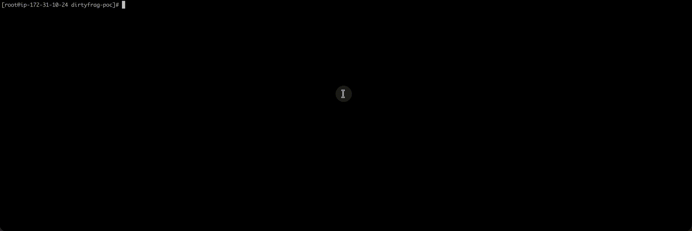

# Dirty Frag (CVE-2026-43284) — Kubernetes Container Escape PoC

A proof-of-concept demonstrating how a **default, unprivileged Kubernetes Pod** can achieve **node-level code execution** on Amazon EKS by exploiting the Dirty Frag Linux kernel page-cache corruption vulnerability through shared container image layers.

The core attack primitive is: **any privileged DaemonSet sharing image layers with an attacker-controlled container can be weaponized for container escape**. This PoC uses kube-proxy as one concrete example, but the technique generalizes to any privileged workload on the cluster.

Validated on **Amazon EKS** (kernel 6.12.80) — an unprivileged pod writes `[*] success` to the host filesystem via the privileged kube-proxy DaemonSet:



> **Disclaimer:** This repository is published for educational and defensive purposes only. Use it exclusively on systems you own or have explicit authorization to test.

## Background

Dirty Frag (CVE-2026-43284) is a Linux kernel page-cache corruption vulnerability in the xfrm/ESP receive path. In the affected path, `esp_input()` can skip `skb_cow_data()` for a non-linear skb without a `frag_list`, allowing `crypto_authenc_esn_decrypt()` to store 4 bytes of attacker-controlled data into a page-cache page reached through `splice()`.

The file on disk is not modified. The corrupted bytes live in the kernel page cache and are observed by later readers of the same cached file page.

For full details on the original vulnerability, see [V4bel/dirtyfrag](https://github.com/V4bel/dirtyfrag).

## Attack Principle

The attack exploits three properties that commonly coexist in Kubernetes clusters:

1. **Kernel page-cache corruption (CVE-2026-43284)** — an unprivileged process (with user namespace support) can overwrite the in-memory cached pages of any file it can open read-only, via the xfrm/ESP splice race.
2. **Image layer sharing** — container runtimes (containerd, CRI-O) use overlay filesystems where identical image layers map to the same page-cache pages across containers.
3. **Privileged DaemonSets** — many clusters run DaemonSets with elevated privileges (`privileged: true`, `hostNetwork: true`, broad capabilities, etc.) that periodically execute binaries from their image.

When these conditions align, an unprivileged pod can corrupt a binary in a shared image layer, and a privileged DaemonSet on the same node will unknowingly execute the corrupted binary with its elevated privileges — achieving full node-level code execution.

**The vulnerability target is NOT limited to kube-proxy.** Any privileged DaemonSet (monitoring agents, CNI plugins, log collectors, security agents, etc.) whose container image shares layers with an attacker-controlled image is a viable target.

## Difference from Copy Fail

This project is inspired by the Kubernetes exploitation model documented in the [Copy Fail Kubernetes PoC](https://github.com/Percivalll/Copy-Fail-CVE-2026-31431-Kubernetes-PoC), but uses a different kernel primitive.


| Property              | Copy Fail                          | Dirty Frag                                                                    |
| --------------------- | ---------------------------------- | ----------------------------------------------------------------------------- |
| CVE                   | CVE-2026-31431                     | CVE-2026-43284                                                                |
| Kernel path           | `AF_ALG` + `splice()`              | `xfrm/ESP` + `splice()`                                                       |
| Namespace requirement | Not required                       | Requires user namespaces                                                      |
| Main capability used  | None in the initial container      | `CAP_NET_ADMIN` inside the new net namespace                                  |
| Relevant module       | `algif_aead`                       | `esp4`                                                                        |
| Practical distinction | Breaks if AF_ALG vector is blocked | Still relevant when AF_ALG is unavailable but ESP/user namespaces are enabled |


## How It Works

The attack chain has three stages: **page-cache corruption**, **cross-container propagation**, and **privileged execution**.

### 1. Page-Cache Patching via xfrm/ESP

The PoC binary performs the following sequence from an unprivileged container:

1. Enters new user and network namespaces with `unshare(CLONE_NEWUSER | CLONE_NEWNET)`.
2. Registers many xfrm Security Associations whose high sequence fields encode 4-byte payload chunks.
3. Opens a target binary from the shared image layer read-only.
4. Uses `splice()` and crafted ESP input to trigger the vulnerable kernel path.
5. Repeats the primitive until the target binary's page-cache contents contain the embedded payload.

No write permission to the target file is required. The file on disk is unchanged — only the in-memory page cache is corrupted.

### 2. Cross-Container Propagation via Shared Layers

Container runtimes serve reads from overlay lower layers through the kernel page cache. If the PoC container and `kube-proxy` share the same lower-layer file, both observe the same cached pages.

The EKS image in this repository is built from:

```text
public.ecr.aws/eks-distro-build-tooling/eks-distro-minimal-base-iptables:2026-03-11-1773190710.2023
```

That base is chosen to match the EKS `kube-proxy` userspace toolchain layer used in the validated environment.

### 3. Privileged Execution by kube-proxy

When `kube-proxy` next executes a patched iptables-family binary, the kernel loads the corrupted cached pages. The PoC payload mounts the host root device and writes a marker file to `/root/res`.

The expected marker content is:

```text
[*] success
```

### Attack Flow Diagram

```
┌──────────────────────────────┐     ┌────────────────────────┐     ┌──────────────────────────┐
│  PoC Pod                     │     │  Kernel Page Cache     │     │  kube-proxy DaemonSet    │
│  unprivileged container      │     │                        │     │  privileged container    │
│                              │     │                        │     │                          │
│  1. unshare user+net ns      │     │                        │     │                          │
│  2. install xfrm SAs         │     │                        │     │                          │
│  3. splice target binary     │────▶│  shared-layer binary   │────▶│  executes patched binary │
│     through ESP path         │     │  page cache patched    │     │  payload runs with       │
│                              │     │                        │     │  node-level privileges   │
└──────────────────────────────┘     └────────────────────────┘     └──────────────────────────┘
```

## Validated Environment

### Amazon EKS


| Property          | Value                                      |
| ----------------- | ------------------------------------------ |
| Platform          | Amazon Elastic Kubernetes Service (EKS)    |
| Node Kernel       | `6.12.80-106.156.amzn2023.x86_64`          |
| Patch State       | Pre-fix kernel, missing `f4c50a4034e6`     |
| `esp4` Module     | Loaded                                     |
| User Namespaces   | Enabled (`user.max_user_namespaces=15030`) |
| SELinux           | Permissive                                 |
| Seccomp           | Unconfined in the tested pod context       |
| Target DaemonSet  | `kube-proxy`                               |
| Target Privileges | `privileged: true`, `hostNetwork: true`    |
| Proxy Mode        | iptables                                   |
| Marker Path       | `/root/res`                                |


### GKE and ACK — Tested, Not Exploitable with Default Configuration

I have tested it on GKE and ACK clusters. All failed.


| Platform          | Result     | Reason                                                                                                                                     |
| ----------------- | ---------- | ------------------------------------------------------------------------------------------------------------------------------------------ |
| Alibaba Cloud ACK | **Failed** | `user.max_user_namespaces` is set to `0` on default node images, so unprivileged users cannot use `CLONE_NEWUSER` unshare.                 |
| Google GKE        | **Failed** | `user.max_user_namespaces` is `15426`, but kubelet enables `--seccomp-default`. The default seccomp policy disables the `unshare` syscall. |


The Dirty Frag primitive **requires user namespace creation** (`CLONE_NEWUSER`) to obtain `CAP_NET_ADMIN` inside a new network namespace. Both ACK and GKE block this at the node level through different mechanisms:

- **ACK**: Kernel-level restriction (`user.max_user_namespaces=0`) completely prevents unprivileged user namespace creation.
- **GKE**: The seccomp default profile (enabled by kubelet's `--seccomp-default` flag) blocks the `unshare` syscall regardless of the namespace limit.

This is a key difference from [Copy Fail (CVE-2026-31431)](https://github.com/Percivalll/Copy-Fail-CVE-2026-31431-Kubernetes-PoC), which does **not** require user namespaces and successfully exploits all three platforms.

## kube-proxy as a Concrete Example

The provided EKS variant patches the following binaries when present:

```text
/usr/sbin/xtables-legacy-multi
/usr/sbin/xtables-nft-multi
```

These binaries are invoked by the iptables toolchain used by `kube-proxy`. The exact trigger timing depends on node and service reconciliation activity. In the validated environment, the payload was triggered by normal `kube-proxy` reconciliation.

**Important caveats:**

- kube-proxy only invokes `ipset` when configured in **ipvs** mode. The default mode (`iptables`) does not use `ipset`.
- Some managed Kubernetes distributions run kube-proxy as a **non-privileged** container, which limits the impact of the escape.
- The PoC targets multiple binaries (`xtables-legacy-multi`, `xtables-nft-multi`) to cover different proxy modes, but whether they get invoked depends on cluster configuration.

**If kube-proxy is not privileged in your cluster, the attack principle still holds** — you just need to identify a different privileged DaemonSet that shares image layers with a base image you can build from.

## Repository Structure

```
.
├── exploit/
│   └── dirtyfrag.c              # xfrm/ESP page-cache writer
├── payload/
│   ├── payload-eks.c            # nolibc payload that writes /root/res on the host
│   └── nolibc/                  # Linux nolibc headers
├── deploy/
│   └── poc-eks.yaml             # unprivileged EKS Deployment manifest
├── scripts/
│   ├── setup-eks.sh             # copy, build, and import image on an EKS node
│   ├── run-poc.sh               # deploy and check marker
│   └── cleanup.sh              # remove pod, marker, cached pages, and local image
├── Dockerfile.eks               # EKS image based on eks-distro-minimal-base-iptables
├── Makefile                     # payload, exploit, Docker, and nerdctl build targets
└── .github/workflows/
    └── docker-publish.yml       # GHCR publishing workflow
```

## Building and Usage

```bash
# Build payload + exploit binary
make build-eks CC=x86_64-linux-gnu-gcc

# Build Docker image
make docker-build-eks

# Deploy (unprivileged pod)
kubectl apply -f deploy/poc-eks.yaml

# Check logs
kubectl logs deployment/dirtyfrag-poc-eks

# Verify escape on the node
ssh ec2-user@<node-ip> "sudo cat /root/res"
# Expected: [*] success
```

The GitHub Actions workflow (`.github/workflows/docker-publish.yml`) publishes the image to GHCR on push to `main` or tag creation. Replace `<owner>` in `deploy/poc-eks.yaml` with the GitHub user or org that owns the fork.

### Clean Up

```bash
kubectl delete -f deploy/poc-eks.yaml --ignore-not-found
ssh ec2-user@<node-ip> "sudo rm -f /root/res"
kubectl delete pod -n kube-system -l k8s-app=kube-proxy --force
```

## Affected Versions

- **Linux kernel**: All versions before the CVE-2026-43284 patch (commit `f4c50a4034e6`).
- **Kubernetes**: Any version using an unpatched node kernel with user namespaces enabled. The vulnerability is in the kernel, not in Kubernetes itself. Kubernetes merely provides the execution context (shared image layers + privileged DaemonSets) that elevates the impact from local page-cache corruption to full container escape.

## Mitigation

- **Patch the kernel.** Update to a kernel containing the Dirty Frag fix, including commit `f4c50a4034e6` or the vendor backport.
- **Disable unused ESP modules.** Block `esp4` and `esp6` if IPsec ESP is not required on worker nodes.
- **Restrict user namespaces.** Setting `user.max_user_namespaces=0` prevents this PoC from obtaining `CAP_NET_ADMIN` in a new network namespace (this is already the default on ACK).
- **Use restrictive seccomp profiles.** RuntimeDefault or custom profiles can block key namespace and networking syscalls (this is already the default on GKE).
- **Minimize privileged DaemonSets.** Avoid `privileged: true` and broad host access unless strictly required.
- **Reduce layer sharing with privileged workloads.** Use distinct base images for privileged agents and control where untrusted workloads can run.

Example module block:

```bash
printf 'install esp4 /bin/false\ninstall esp6 /bin/false\n' | sudo tee /etc/modprobe.d/dirtyfrag.conf
sudo rmmod esp4 esp6 2>/dev/null || true
```

## Credits

- **Dirty Frag research and original exploit**: [V4bel/dirtyfrag](https://github.com/V4bel/dirtyfrag)

## References

- [Dirty Frag - V4bel/dirtyfrag](https://github.com/V4bel/dirtyfrag)
- [LWN coverage](https://lwn.net/Articles/1071719/)
- [CVE-2026-43284 xfrm/ESP discussion](https://lwn.net/ml/all/afzgS2SCWNcZU3vU%40v4bel/)
- [Copy Fail Kubernetes PoC](https://github.com/Percivalll/Copy-Fail-CVE-2026-31431-Kubernetes-PoC)

## License

Exploit code is adapted from [V4bel/dirtyfrag](https://github.com/V4bel/dirtyfrag) under the MIT license.

Payload code is derived from [tgies/copy-fail-c](https://github.com/tgies/copy-fail-c) and is dual-licensed under **LGPL-2.1-or-later** OR **MIT**.

nolibc headers are from the Linux kernel self-test infrastructure.